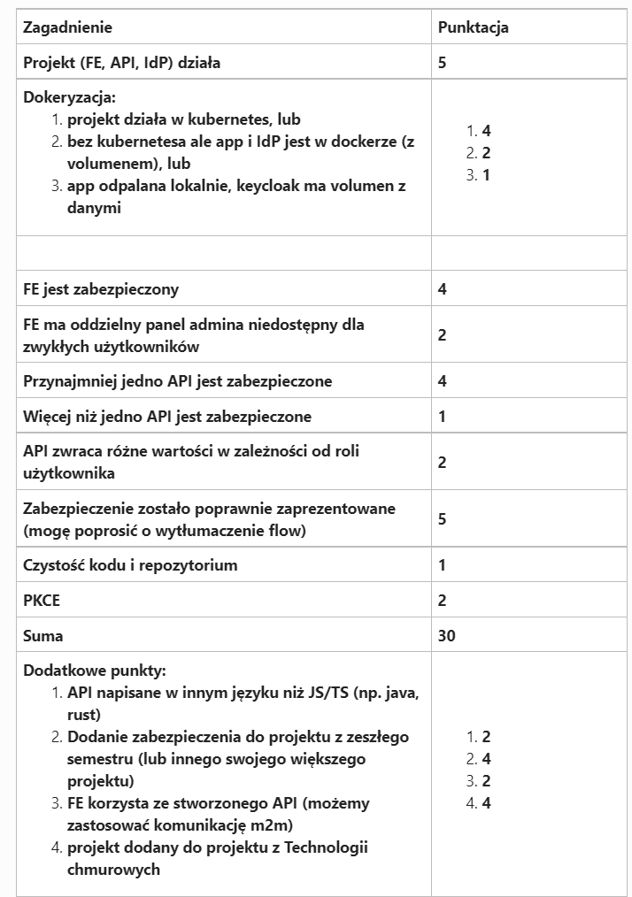

Dedykowany frontend: http://localhost:5173
Frontend od fanów korzystających z zawężonej puli endpointów RS: http://localhost:4000

Aby komponenty projektu, należy:

- uruchomić polecenie "docker-compose up" z poziomu root directory projektu
- odpalić serwer z zasobami (resource server) za pomocą node api/server.js

Aplikacja jest prostym połączeniem dotychczasowych laboratoriów z dodatkiem paru nowych funkcjonalności przykładów. Projekt/demonstracja użycia OAuth 2.0 zawiera w sobie następujące części związane z protokołem OAuth 2.0:
- resource server (api),
- dedykowany dla RS frontend aplikacji (app),
- fanowska aplikacja frontend mająca dostęp do części endpointów RS (fan-frontend-app)
- klient do zewnętrznego serwisu (spotify), który komunikuje się z resource serverem (przykład m2m, oraz kolejny przykład wykorzystania OAuth do uzyskania dostępu do tylko danej części zasobów pewnego resource serwera, w tym wypadku serwera spotify). Po swoim kliencie do IDP posiadają również wcześniej wspomniane komponenty aplikacji. W sumie 4 klienty - 3 do głównego IDP oraz 1 od spotify.

Do obu aplikacji frontend użyty został code authorization grant flow z PKCE.
Do komunikacji m2m, mój resource serwer z resource serwerem spotify użyty został flow client credentials.

Dodatkowo serwer keycloak został skonfigurowany, aby wymagał od użytkowników weryfikacji dwuetapowej z wykorzystaniem Google Authenticator.

Ponadto użytkownicy mogą skorzystać z resetowania hasła konta drogą mailową, co umożliwa skonfigurowany i skomunikowany z serwerem keycloak serwer SMPT o adresie "taylorswiftfanskeycloak@onet.pl"

Główna aplikacja obsługuje 3 role użytkownika - "admin", "moderator", "user".
Przy rejestracji (keycloak również jest tak skonfigurowany, aby ją umożliwiał), użytkownikowi przypisywana jest domyślnie rola "user". Konta moderatora i administratora muszą być tworzone ręczne w panelu administracyjnym keycloak.

Wymagania:

Wszystkie obowiązkowe wymagania poza pkt. "Dockeryzacja" (wszystko jest w docker composie razem z wolumenami, oprócz samego resource serwera, bo nie działa wtedy weryfikacja ISP tokenu. Nie zdążyłem tego naprawić, ale nie powinno być to trudne - kwestia localhost!=keycloak, keycloak!=localhost) zostały w pełni zawarte w projekcie.

Z dodatkowych wymagań, aplikacje frontend korzystają ze stworzonego api.

W projekcie zawarłem również parę rzeczy nie wspomnianych w wymaganiach.

Ocena z egzaminu: 5
